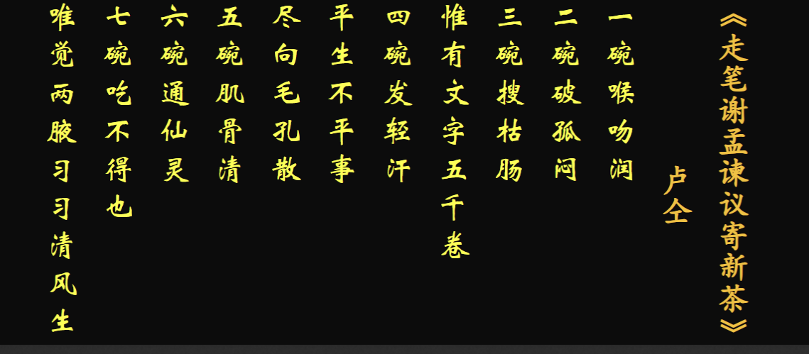
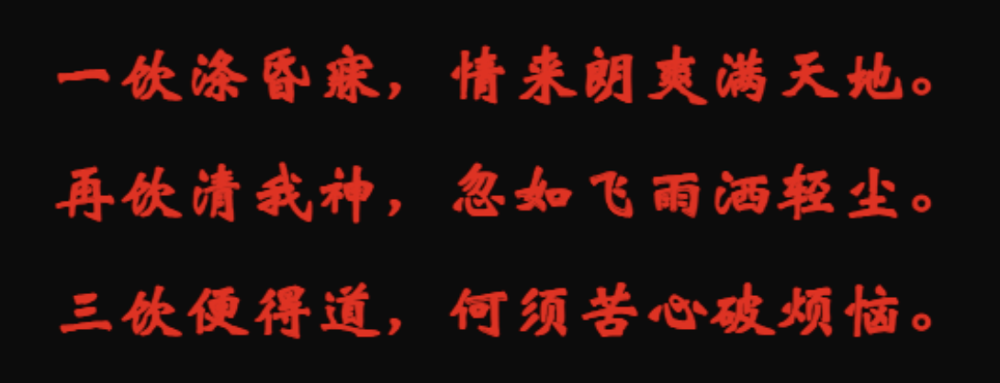
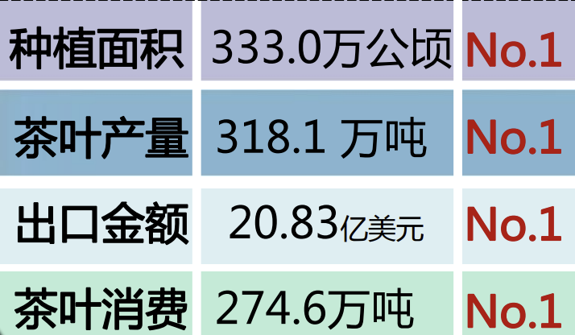

# 茶文化与茶健康

## 茶文化

### 茶历史

1. 1606年（明万历三十四年），第一批中国茶叶抵达荷兰，这是茶叶第一次作为商品出口到欧洲，拉开了中国200多年的茶叶全球贸易垄断史。
2. 1637年，茶叶开始大规模出口了，到1806年（清嘉庆十一年），茶叶已经占到中国商品总出口的50%以上，高峰期超过70%
3. 国际茶日：5.21

### 茶叶加工方式的变迁

> 煮茶法

> 煎茶法

> 点茶法

### 现代饮茶法的茶艺流程

> 润具

> 温润泡

> 摇香

**2022年11月29日**，由我国申报的“**中国传统制茶技艺及其相关习俗**”入选联合国教科文组织**人类非物质文化遗产代表作名录**，至此，我国共有**43个项目**列入联合国教科文组织非物质文化遗产名录、名册，居世界第一。该项目涉及**15个省（区、市）**共**44**个国家级非遗代表性项目，其中，**浙江省**的**4个**传统制茶技艺项目**西湖龙井、婺州举岩、紫笋茶、安吉白茶**，以及 **2个茶相关习俗庙会（赶茶场）、径山茶宴**是该遗产项目的重要组成部分。

### 茶书

> 《大观茶论》

《大观茶论》原名《茶论》，是宋徽宗赵佶所著的关于茶的专论。

> 《吃茶养生记》

日本**荣西禅师**在中国潜修佛法，回国著《吃茶养生记》，记录**南宋**时期流行的制茶和点茶法。

### 名人

> 茶圣陆羽

陆羽（733年—约804年），名疾，字鸿渐，又字季疵，**唐代复州竟陵（今湖北天门）人**。唐代茶学家、茶文化奠基人。

> 当代茶圣:吴觉农

吴觉农（1897年*－*1989年），原名荣堂，因立志要献身农业（茶业），故改名觉农，浙江[上虞](https://baike.baidu.com/item/上虞/197589?fromModule=lemma_inlink)人。 [2]中国知名的爱国民主人士和[社会活动家](https://baike.baidu.com/item/社会活动家/9719483?fromModule=lemma_inlink)，著名[农学家](https://baike.baidu.com/item/农学家/338660?fromModule=lemma_inlink)、[农业经济学](https://baike.baidu.com/item/农业经济学/485327?fromModule=lemma_inlink)家，现代茶叶事业复兴和发展的奠基人。

### 茶诗

> 元稹《一至七字诗》

> 卢仝《七碗茶诗》

> 皎然

> 陆羽

## 茶科学

### 茶树的植物学特性

1. 茶树是哪一科植物？起源于哪里？关于其起源的主要证据有哪些？

   山茶课 山茶属 茶种(Camellia sinensis(L.))

   L是卡尔·林奈（Carl Linnaeus）姓名的缩写

2.   茶树的树型形态有哪几种？

   乔木，灌木、小乔木 

3.  如何判断一片叶子是茶叶？ 

   1. 叶边有锯齿，叶基无
   2. 有明显的主脉
   3. 叶脉呈网状
   4. 嫩叶背后生绒毛

4.  茶花什么色？茶花什么季节开？ 

   1. 茶花为两性花，多为白色，少数呈蛋黄或粉红色
   2. 茶花的花瓣通常为5到7瓣
   3. 茶花秋冬季节开

5. 茶的起源?茶起源于中国的证据

   * 中国西南地区山茶科植物最多，是山茶属植物的分布中心
   * 中国西南地区野生茶树最多，（1200多年前，10省/区200多处地方相机发现野生大茶树，其中70%集中在云南，中国西南部山区的野生茶树，其类型之多、数量之大、面积之广、世界罕见——原产地植物最显著的植物地理学特征）
   * 中国西南地区种内变异最多
   * 中国西南地区最早发现并利用茶，茶文化内容最丰富
   * 最早的茶植物学名
   * 茶叶生化成分提供的特殊线索

### 茶的成分

1. 茶叶特征性成分有哪几种？对应的味道分别是？ （重点）

   * 茶室各种各样的生化反应产生的一系列化学成分组成的特殊物质
   * **茶多酚（18-37%）、咖啡因（3-5%）、茶氨酸（1-4%）**
   * 茶多酚——涩
   * 咖啡因——苦
   * 茶氨酸——鲜爽

2. 茶叶中经鉴定的内含成分大概有多少种？其中水分含量大约占 ？ 

   * 茶叶中的化学成分已知经过分立鉴定的化合物有700多种
   * 茶树鲜叶中：**水分:75-78%** ，干物质，22%-25%
   * 有机物中:
     * **蛋白质:20-30%**
     * 糖类:20-25%
     * **茶多酚类:18%-36%**
     * 脂质：8%
     * **生物碱: 3-5%(咖啡碱为主)**
     * **有机酸:1-4% （茶氨酸为主）**
     * 色素1%
     * 维生素0.6-1%
     * 芳香物质:0.005-0.03%

3. 茶多酚是什么，它的分类，它的作用

   * 茶多酚之父：杨贤强

   * 别称：茶鞣质，茶单宁，多酚类物质的总成

   * 作用：生长发育，新陈代谢关系密切，对品质影响最为显著

   * 含量:18-36%

   * 成分:

     

     > 黄酮类
     >
     > 
     >
     > 黄烷醇类
     >
     > 
     >
     > 重要成分:EGCG(属于儿茶素)，它的功效如下:
     >
     > **抗心血管疾病（Anti-cardiovascular）**
     >
     > **抗癌（Anti-cancer）**
     >
     > **抗过敏（Anti-allergic）**
     >
     > **神经保护（Neuroprotection）**
     >
     > **抗肥胖（Anti-obese）**
     >
     > **抗糖尿病（Anti-diabetic）**
     >
     > **抗氧化（Anti-oxidant）**
     >
     > **促进肠道健康（Gut health）**
     >
     > 

   * 茶多酚的组成有哪四种?

     * **儿茶素类；黄酮素和黄酮醇类、花青素和花白素类；酚酸和羧酸酚类**

4. 生物碱是什么?咖啡碱的作用

   * **茶叶中的生物碱，有嘌呤和嘧啶两类衍生物，而且主要是嘌呤类衍生物。因此，研究茶叶中的生物碱主要是指嘌呤碱**

   * 茶叶中的嘌呤碱—**黄嘌呤的甲基衍生物**

     * 咖啡碱(2-5%)、茶叶碱(0.05%)、可可碱(0.002%)
     * 茶叶中的咖啡碱含量高于咖啡

   * 咖啡碱的功能

     兴奋功能，强心功能、促进消化液的分泌、抗过敏、炎症功能、抗肥胖作用、利尿作用。

5. 茶氨酸是什么?占比？茶氨酸是如何合成的?

   * 茶氨酸是茶中独有的**品质**和功能成分
     * 鲜醇滋味的决定因子，参与茶叶香气形成，标志性品质成分
     * 功能：镇静安神、利于睡眠、愉悦心情，减轻抑郁，延缓衰老
   * 占比:1-4%，**茶氨酸约占茶叶中游离氨基酸的50%**
   * 茶氨酸的合成依靠**茶氨酸合成酶**，合成部位是根部
     * 分布在茶树的根和茶芽叶中，最适pH7.5，最适温度35°
     * 合成原料：谷氨酸，谷氨酰胺（茶氨酸/谷氨酰乙胺）
   * **茶氨酸功能：镇定作用，增强记忆、抗焦虑、提高免疫力、改善经期综合症(PMS)，肝脏排毒、抗疲劳、抗抑郁——21世纪"新天然镇定剂"**

6. **茶的三大自然物质是?**、

   1.  茶多酚、茶氨酸、咖啡碱

7. 茶叶氨基酸与茶氨酸的联系和区别?

   **来源**：茶叶氨基酸和茶氨酸都来源于茶叶。茶氨酸是茶叶氨基酸的一种，属于茶叶中含量较为丰富的氨基酸之一。

   **氨基酸类型**：茶氨酸本质上是氨基酸的一种，具有氨基和羧基结构。它与其他氨基酸一样，参与茶叶的氨基酸组成，对茶的风味和健康效益有影响。

   茶氨酸占游离氨基酸的50%

8. 茶产量成分、品质成分、营养成分、功效成分有哪些？

   **产量成分**：水分、干物质。

   **品质成分**：茶多酚、氨基酸、咖啡因、挥发性香气物质、糖类、有机酸。

   **营养成分**：维生素C、B群维生素、矿物质、膳食纤维。

   **功效成分**：茶多酚、咖啡因、茶氨酸、矿物质、有机酸。

9. “冷后浑”中主要有什么物质？ 

   * 冷后混的原理:**咖啡碱与酚类及其氧化产物结合，不但减轻了苦涩味（茶多酚-涩，咖啡碱-苦），使滋味更加醇和，而且影响人体对茶叶中的咖啡碱的吸收率，减轻咖啡碱的刺激作用**
   * 冷后浑的产生条件
     * caffeien的含量要达到2%
     * TF(茶多酚的氧化产物)含量要高于0.4%
   * 冷后浑中的主要物质:**茶黄素、茶红素（TF,TR）**和**咖啡碱**

10. 茶叶中的天然色素分为哪两类 ？都各自主要包括什么色素?

   * 脂溶性色素和水溶性色素
   * 脂溶性色素主要包括叶绿素类和类胡罗卜素
   * 水溶性色素主要包括花黄素类和花青素类（黄酮素和黄铜醇类）

11. 茶叶加工过程中形成的色素有哪些?

    * 茶黄素类 : TFs ;
    * 茶红素类 : TRs
    * 茶褐素类 : TB 

12. 茶多糖(TPS)

    茶叶中具有生物活性的复合多糖，是一类与蛋白质结合在一起的酸性多糖或酸性糖蛋白。茶多糖也可以与多酚、金属元素络合】形成具有复杂组成的大分子化合物，TPS具有广泛的生物活性

13. 茶多酚氧化聚合形成的主要衍生物是哪些？ 

14. 被誉为“当代茶圣 ”的是 先生，他为新中国茶的发展作出了杰出贡献。

15. 茶中的脂溶性色素和水溶性色素对茶叶，茶底、茶汤的影响。

    **1. 脂溶性色素**

    脂溶性色素在茶叶中主要包括**叶绿素**及其衍生物（如脱镁叶绿素）和类胡萝卜素（如β-胡萝卜素、叶黄素）。这些色素不溶于水，更多地影响干茶和叶底的颜色。

    **对干茶、叶底和茶汤的影响**

    - **干茶**：
      - 叶绿素衍生物在绿茶和部分乌龙茶中占主导，使干茶呈现**翠绿色或暗绿色**。
      - 类胡萝卜素参与茶叶氧化过程，影响红茶的干茶颜色，使其显现**褐红色或金黄色**。
    - **叶底**：
      - 在绿茶中，脂溶性色素保留较多，叶底呈现**鲜绿色**。
      - 在红茶和部分发酵茶中，叶绿素发生氧化降解，叶底变为**红褐色**。
    - **茶汤**：
      - 脂溶性色素不溶于水，因此对茶汤颜色的直接贡献较小，主要通过氧化产物（如胡萝卜素氧化衍生物）间接影响茶汤的金黄色调。

    水溶性色素主要包括**茶黄素**、**茶红素**、**茶褐素**和花青素等。这些色素直接溶于水，是茶汤颜色的主要来源。

    **2 水溶性色素对干茶、叶底和茶汤的影响****

    - **干茶**：
      - 水溶性色素含量间接影响干茶的色泽，尤其是红茶中，茶黄素和茶红素在干茶表面体现出**乌黑油润**或**金黄色的毫尖**。
    - **叶底**：
      - 水溶性色素随着茶叶浸泡被释放，因此叶底的颜色会变淡。例如，红茶的叶底因水溶性色素溶出，呈现**暗褐色**或**红褐色**。
    - **茶汤**：
      - 水溶性色素是茶汤颜色的决定性因素：
        - **茶黄素**：使茶汤呈现**鲜艳的金黄色**，常见于优质红茶。
        - **茶红素**：使茶汤显得**红浓透亮**，是红茶汤色的主要来源。
        - **茶褐素**：使茶汤呈现**深暗色**，是品质稍低或陈茶中茶汤暗沉的原因。
        - **花青素**：在绿茶或部分未发酵茶中提供轻微的**绿色或浅黄色**调。

### 环境因子对茶叶品质的影响

1. 茶树喜欢什么样的生长环境?哪些环境因子对茶叶品质产生影响?

   * 喜光怕晒（耐荫凉）——光照

   * 喜湿怕涝——水分

   * 喜温怕寒——温度

   * 喜酸怕碱——土壤

     （从光温气水肥角度作答）

   * 对茶叶品质产生影响的环境因子:温度、光照、水分、小气候（空气）、土壤

2. 五种环境因子是怎么影响茶叶品质的?

   * 光照 : 遮荫处理**增加茶叶氨基酸、咖啡因的水平**，降低了**茶多酚**的含量，**提高了绿茶的营养和感官质量**

     * 茶氨酸、咖啡因与茶多酚（最多）是拮抗的
     * 抹茶一般会采用大面积遮荫

   * 温度：温度升高，茶树叶片中**游离氨基酸和咖啡碱含量下降**，茶多酚含量显著增高，酚氨比显著升高

   * 水分：茶叶处于**水分胁迫时**，茶多酚和氨基酸等内含成分含量下降，最终导致茶叶减产和品质下降。

     > 茶多酚正响应于环境因子

   * 小气候：一般指近地面几米气层内，土壤表层和植被层内的气候。绿化、灌溉、改变土壤情况，改造小地形、营造防护林和设置风幛等都可以改变地表附近的水热状况

3. 高山出好茶？

    **温度与昼夜温差的影响**

   - **昼夜温差大**：

     - 高山地区昼夜温差显著，这种条件促进了茶叶中**芳香物质**和**可溶性糖分**的积累，减少了茶叶中过多苦涩味物质的合成。

     - 生化机理

       ：

       - 夜间低温：抑制了代谢消耗，使得白天光合作用积累的碳水化合物（如糖类）得以保留，提升茶汤的甜润感。
       - 白天温暖：适宜的温度促进了叶片的次生代谢，增加了芳香物质的合成。

   - **温度适中**：

     - 高山的温度普遍低于平地，这种适中偏低的温度减少了茶树的生长速度，使茶叶生长周期延长，形成了**叶片细胞组织更为紧密**的特点。

     - 生化机理

       ：

       - 较慢的生长速度使茶叶中**茶多酚**、**氨基酸**等内含物质比例更为均衡，避免了茶多酚过多导致的苦涩味。

   ------

    **2. 光照与紫外线的作用**

   - **光照强度适中，漫射光多**：

     - 高山上云雾缭绕，遮挡了直射光，提供了柔和的漫射光环境，减少了叶绿素光降解的速率。

     - 生化机理

       ：

       - 漫射光促进了**茶氨酸**的合成，这种氨基酸赋予茶叶鲜爽滋味。
       - 柔和光线还能减缓光氧化作用，保护了茶叶中的芳香物质和叶绿素，使得茶叶色泽更加翠绿。

   - **紫外线较强**：

     - 高海拔地区紫外线强度高，茶树为应对紫外线压力，会加速次生代谢，合成更多**类黄酮**和**茶多酚**以抵抗光损伤。

     - 生化机理

       ：

       - 类黄酮（如儿茶素）是抗氧化剂，它不仅提升了茶叶的健康价值，还改善了茶汤的浓度和鲜爽感。

   ------

    **3. 湿度与水分调节**

   - **空气湿度高**：

     - 高山地区的湿度通常较大，有助于减少茶叶的水分蒸腾，使茶叶保持较高的含水量，避免因水分流失而过早老化。

     - 生化机理

       ：

       - 高湿环境促使茶树细胞的膨压保持良好，代谢过程更活跃，茶叶中芳香物质和水溶性成分积累更多。

   - **土壤水分适中**：

     - 高山土壤多为火山岩或壤土，透气性好，水分供给均匀，为茶树提供了稳定的生长条件。

     - 生化机理

       ：

       - 良好的水分调节能力避免了干旱胁迫，保证了茶树代谢产物（如茶氨酸和可溶性糖分）的正常积累。

   ------

    **4. 大气成分与气候条件**

   - **氧气与二氧化碳含量**：

     - 高山地区空气稀薄，相对的氧气浓度较低，二氧化碳利用率更高，茶树光合作用效率提升。

     - 生化机理

       ：

       - 茶树在低氧环境中会加速次生代谢，增加芳香物质和类黄酮的合成，从而提升茶叶香气和风味。

   - **清新的空气**：

     - 高山环境空气污染少，茶叶生长免受有害物质侵害，内含物质更纯净。

   ------

    **5. 病虫害少，减少农药使用**

   - **高山环境低温、湿度适中**：

     - 低温和昼夜温差大使得许多害虫无法在高山环境中存活，茶树病虫害少。

     - 生化机理

       ：

       - 茶树无须过多投入次生代谢用于抗虫害，更多的代谢能量用于合成优质的芳香物质和茶多酚。

   - **减少化学干预**：

     - 农药使用的减少保证了茶叶品质的自然性和纯净性，内含物质在天然状态下达到最佳比例。

   ------

    **6. 茶叶品质的表现**

   - **香气**：高山茶香气更为馥郁，芳香物质（如萜烯类化合物）含量显著高于平地茶。
   - **滋味**：茶汤鲜爽度高，甜润感强，苦涩味低，氨基酸与多酚比例更协调。
   - **色泽**：干茶和叶底色泽更加翠绿明亮，茶汤呈现清澈的金黄或翠绿色。
   - **持久性**：高山茶滋味和香气持久耐泡，茶汤稳定性更高。

## 茶科技

1. 中国分哪六大类？分类依据是什么？不同茶类的品质特征有什么区别？ 

   * 绿茶、白茶、黄茶、乌龙茶、红茶、黑茶

   * 分类依据：茶叶品质系统性和制法的系统性

     * 发酵程度及品质特征：发酵程度指的是**茶多酚类**物质的**酶促氧化**程度

       > 发酵过程中，各种化学反应都很活跃，其中最重要的是以**PPO(多酚氧化酶)**和**POD(过氧化物酶)**促进的茶多酚等物质的酶促氧化作用。
       >
       > 黑茶则是以微生物参与的酶促作用为主。

     * 绿茶：不发酵茶，绿叶绿汤

     * 白茶：微发酵茶，干茶绒毛多呈白色，汤色浅淡。

       

     * 黄茶：轻发酵茶，黄叶黄汤

       

     * **青茶(乌龙茶)：半发酵茶，绿叶红镶边，汤色金黄。**

       

     * 红茶：全发酵茶，红汤红叶

     * 黑茶：后发酵茶，叶色黝黑，汤色褐黄或褐红

       

2. 六大茶类的加工顺序

   

3.  绿茶杀青工艺、黄茶闷黄工艺、红茶发酵工艺、黑茶渥堆工艺的特征和目的原理是什么？

   * 杀青(绿茶，黄茶，黑茶)：
     * 采用微波、热风、蒸汽、锅炒和蒸汽-热风组合等不同杀青方法，利用高温钝化鲜叶中氧化酶的活性。使茶叶变软，便于揉捻
     * 鲜叶通过**杀青**，**酶的活性钝化**，内含的各种化学成分，**在热力作用下发生物理化学变化**，形成“清汤绿叶”的品质特征。
   * 闷黄(黄茶)
     * 闷黄是黄茶加工的典型工序，指茶叶在湿热条件下发生热化学反应的过程（是指**将杀青或揉捻或初烘后的茶叶趁热堆积，使茶坯在湿热作用下逐渐黄变的特有工序**），是形成黄茶**“黄汤黄叶”**品质特征的关键工序。
     * 君山银针、蒙顶黄牙
   * **萎凋**（白茶）
     * 白茶加工不经炒揉，只有**萎凋和烘焙**两道工序。其加工工艺虽看似简单，但对鲜叶原料要求严格，**鲜叶在萎凋过程中发生轻微的氧化反应**，其过程是复杂而深刻的。
   * 做青（乌龙茶）
     * 做青是清茶（乌龙茶）加工的关键工序，通过叶片相互碰撞，擦伤叶缘，促进酶促氧化（**酶促氧化程度逐渐加深**），是形成青茶“绿叶红镶边”品质特征的关键。
   * 发酵（红茶）
     * 发酵是红茶加工的关键工序，是形成红茶“红汤红叶”品质特征的关键
   * 渥堆（黑茶）
     * 在杀青、揉捻工序后有一特殊的“渥堆”工序，是在**微生物作用和湿热作用兼有的过程**，**造就了黑茶味醇而少爽，味厚而不涩的品质特征**

4. 生普熟普指的是什么？它们分别属于哪一类茶?

   * 生普：**没有渥堆发酵的过程，属于晒青绿茶**
   * 熟普：**属于黑茶**
   
   

## 茶健康

1. 茶叶通常呈酸性还是碱性？茶叶是酸性食品还是碱性食品？ 

2. 茶多酚、茶氨酸、咖啡碱分别有什么健康功能？ 

3. 茶叶中具有兴奋作用的成分是 ，而 具有舒缓和镇静作用。 

4. 如何利用咖啡碱易溶于热水的性质指导特殊人群科学饮茶？ 

5. 简述茶叶的主要健康功能。

6. 请从自由基病因学的角度简述茶叶保健功能的作用机理。 

7. 如何从茶类、体质、季节等方面指导日常科学饮茶？ 

8. 论述茶叶对现代人心理疾病的防治与缓解作用？ 

9. 茶叶中的哪些成分对糖尿病有一定缓解作用？ 

10. 如何判断一个人是否肥胖？简述茶叶降脂减肥的作用和机理

11. 什么是健康？什么是"亚健康"？维持健康的四大基石是什么？

    1. 健康是身体、精神和社会适应上的完美动态，而不仅是没有疾病或是身体不虚弱。
    2. 亚健康是人们表现在**身心情感**方面的处于健康与疾病之间的健康低质量状态及其体验。亚健康状态是指**无器质性病变**的一些功能性改变，又称第三状态或“灰色状态”。因其主诉症状多种多样，又不固定。
    3. 维持健康的四大基石是：**合理膳食、适量运动、戒烟限酒、心里平衡**。

12. 健康的基本概念是什么？论述营养与健康的关系。

     健康是身体、精神和社会适应上的完美动态，而不仅是没有疾病或是身体不虚弱。人体健康是心理健康和生理健康的统一，两者是相辅相成、互相依存的。生理健康是心理健康的基础，心理健康反过来又促进生理健康。

    营养与健康的关系主要表现在以下几个方面。

    **1）促进生长发育**：影响生长发育的主要因素有营养、运动、疾病、气候、社会环境和遗传因素等，其中营养因素占重要地位。

    **2）提高智力**：营养状况对人类的智力影响极大，儿童时期和婴幼儿时期是大脑发育最快的时期，需要足够的营养物质，如果摄入不足，就会影响大脑的发育阻碍智力开发。

    **3）促进优生**：影响优生的因素有遗传方面的，但营养也是一个不容忽视的重要因素。孕妇的饮食缺乏营养，就可能会导致胎儿畸形、流产、早产等。

    **4）增加免疫功能减少疾病的发生**：免疫是机体的一种保护反应，如免疫能力低下，则易受各种病菌的侵害，营养不良患者的吞噬细胞对细菌攻击的反击能力降低，从而导致疾病的发生。而食物中的一些营养物质具有提高免疫能力的作用。

    **5）促进健康长寿**：人体的衰老是自然界的必然过程，但注意摄取均衡营养，有针对性地补充营养，多吃蔬菜、水果等清淡食物，避免热量和动物脂肪的过量摄入，可以防止高血压、心脑血管疾病的产生，以达到延年益寿的目的。

13. 癌症的发病原因三种外部因子是什么？癌细胞的三大特征是什么？

    * 癌症源自于一个单细胞。从一个正常细胞转变为一个肿瘤细胞要经过**癌前病变**发展为恶性肿瘤。这些变化是一个人的**基因因素**和**三种外部因子**之间相互作用的结果，
    * 这三种外部因子包括：
      * **物理致癌物质**，例如紫外线和电离辐射；
      * **化学致癌物质**，例如石棉、烟草烟雾成分、黄曲霉毒素和砷；
      * **生物致癌物质**，例如由某些病毒、细菌或寄生虫引起的感染。
    * 癌细胞一般具有**三个显著的基本特征**，它们是**不死性、迁移性**和**失去接触抑制**。

14. 请解释化学致癌三阶段致癌学说。

    * 化学致癌三阶段为**启动、促进和进展**。
    * 一般认为在**启动阶段**，致癌物(如DENA)在体内经代谢活化形成，例如：成亲电性的终致癌物，与细胞核DNA结合，引起DNA损伤而导致细胞突变;
    * 然后在**促进阶段**，细胞分裂时DNA损伤传给子代得以固定，这一阶段是启动细胞克隆后连续增殖的过程；
    * 而后，进一步发展至**癌前病变和癌变**，即进展阶段。

15. 生物体内的抗氧化酶系为哪些？抗氧化酶有什么重要生理功能？

    * 生物体抗氧化酶主要有**超氧化物歧化酶(SOD)**、谷胱苷肽酶类(包括**GSH-Px，GSSG-Tr**)和**过氧化氢酶(CAT)**。

16. 抗氧化酶有什么重要生理功能？

    * 抗氧化酶是人体有益的解毒酶类，它们对减少致癌物质的形成和积累以及对自由基的清除有重要作用。

17. 请详细解释**茶黄素**清除自由基机理的机理

    * **抑制自由基产生**
    * 生物体内自由基的生成具有多种途径，其中主要有3种：
      * **分子氧的单电子还原途径**，氧接受一个电子生成O2·¯或再接受一个电子生成H2O2，H2O2失去一个电子生成·OH或再失去一个电子生成H2O。这一过程主要产生O2·¯，正常情况下，生物体约有2％的总耗氧量经呼吸链旁路(单电子还原过程)生成氧自由基；
      * **酶促催化产生自由基；**
      * **某些生物物质的自动氧化**：过氧化物及某些金属离子的氧化还原均可使机体产生自由基，其中Fe2+催化H2O2产生·OH(Fenton 反应)和过渡金属离子催化LOOH均裂产生脂氧自由基最为常见。茶黄素可通过抑制氧化酶系与络合诱导氧化的金属离子途径达到抑制自由基

    * **茶黄素对上述大部分氧化酶均有抑制作用产生的作用**。黄嘌呤氧化酶系统(XO)、中性粒细胞主要依靠髓过氧化酶系统(MPO)及还原型辅酶Ⅱ(NADPH)氧化形成氧化型辅酶Ⅱ(NADP)产生活性氧，脂氧化酶和环氧化酶、NO合成酶等生物体内许多氧化酶与自由基生成相关。
    * **茶黄素与诱导氧化的过渡金属离子络合**机，体内过渡金属离子是自由基的另一重要来源。过渡金属离子绝大多数均含有未配对电子，都是自由基，**它们可以催化自由基的形成**，茶黄素类物质与金属离子络合可以直接降低LDL的氧化程度，也可抑制机体内Fenton反应, 起到抑制活性氧自由基产生的作用。同时茶黄素类对机体内金属离子释放也具有抑制作用。
    * **直接清除自由基**，茶黄素通过**抑制自由基的产生途径而减少自由基**，对于**机体内固有的自由基，茶黄素则有直接清除效**果。
    * **对抗氧化酶体系的激活作用**。茶黄素除了直接清除自由基或抑制自由基产生，还能通过激活机体自身的自由基清除机制而增强抗氧化效果。正常情况下，机体自由基维持在损伤阈值以下的平衡态，而这种平衡态的维持依赖于机体的抗氧化体系，包括非酶体系和酶体系。抗氧化酶的重要生理功能在于其对自由基的清除作用。生物体抗氧化酶主要有**超氧化物歧化酶**、**谷胱苷肽酶类和过氧化氢酶。**

18. 茶叶的减肥机理是什么？

    * 作为传统的食品和饮料，茶叶有较好的减肥效果。我国古代就有关于茶叶减肥功效的记载“去腻减肥，轻身换骨”，“解浓油”，“久食令人瘦”等。茶叶具有的良好降脂功效是由于它所含的多种有效成分的综合作用，**尤其是茶多酚、咖啡碱、维生素、氨基酸最为重要。**
    * 肥胖是由于**脂肪细胞中的脂肪合成代谢大于分解代谢**所引起的。因此，可以通过减少血液中**葡萄糖、脂肪酸、胆固醇**的浓度，抑制**脂肪细胞中脂肪的合成**以及**促进体内脂肪的分解代谢**达到减肥的效果。
    * 乌龙茶中含有的**多酚类化合物**对**葡萄糖苷酶和蔗糖酶**具有显著的抑制效果，进而减少或延缓葡萄糖的肠吸收，发挥其减肥作用。
    * 国内外有较多的研究者越来越倾向于**认为绿茶、绿茶提取物、EGCG**等是通过抑制**胰腺中脂肪酶的活性**，**抑制饮食来源的脂肪在消化道中的分解**，降低**脂肪分解产物(如甘油三酯)在消化道内的吸收**，以及激活脂肪组织的**激素敏感型脂肪酶活性**进而起到减肥的效果。

19. 医学上“三高”指什么？ “高血压”的危害性是什么？

    * “三高”通常是指**高血压、高血脂和高血糖**症三种病症，属于高发慢性非传染性疾病。
    * 高血压是人类的一种常见病，按其发病机制可以分为**原发性与继发性两类**。
      * 继发性高血压一般有明确的原因，常常是由于某些疾病引起的。**继发性高血压通常仅占高血压患者总数的10%左右**， 如先消除引起高血压的原因，高血压症状可自行消失。
      * 高血压若不治疗，**动脉压的持续升高可导致靶器官如心脏、肾脏、脑和血管的损害**。
      * 由于促进通往大脑的血管阻塞或大脑血管破裂出血等意外发生，所以会**增加中风的危险性**，这两者都会破坏大脑组织。
      * 通常，**高血压危害最严重的是肾血管，导致肾血管变窄或破裂，最终引起肾功能衰竭。**

20. 肥胖对身体健康产生哪些影响？ 

    * **糖尿病（高血糖）**：肥胖会造成血中**胰岛素过度分泌**，越为严重的肥胖者，其**空腹时** 胰岛素浓度越高，而进食后胰岛素的分泌无法相对地提高，所以形成**血糖升高的现象**。并且实验发现，较胖者其细胞中**胰岛素受体较少**，（节流）或是在接受胰岛素时容易出现问题，所以肥胖者会增加**罹患糖尿病**的风险。若是体重减轻，则会改善血糖不正常的情况。
    * 2）**高血压**：**胰岛素过度分泌及胰岛素作用减低**是促成高血压的原因，并且高浓度的胰岛素会借着**加强钠离子的回收及交感神经频度来促进高血压的形成**。若是体重减轻，由于全身血流量、心搏出量及交感神经作用减少，所以血压通常也会下减。
    * 3）**心血管疾病**：肥胖者大多合并有**血脂肪浓度过高**的情形，因此容易发生**血管栓塞**，加速了血管的**粥状变化**，容易造成包括**冠状动脉心脏病、心肌梗塞、缺血性心脏病**...等疾病。研究中亦显示，若能维持理想体重，则可减少心血管疾病、郁血性心脏衰竭及脑栓塞的发生率。
    * 4）关节疾病：因为肥胖者骨头关节所需承受的重量较大，所以较易使**关节老化、损伤而得到骨性关节炎**。
    * 5）**血脂代谢异常：**血脂过高会影响身体携带胆固醇至肝脏的速率，是增加心脏疾病的危险因子。

21. 什么是反式脂肪酸，它的危害有哪些？

    * 反式脂肪酸是一种不饱和脂肪酸（单元不饱和或多元不饱和），是油脂在“氢化”加工过程中的产物。不饱和脂肪酸中如果氢原子都位于同侧，叫做“**顺式脂肪酸”，碳链的形状呈曲折**，如果氢原子位于两侧，叫做**“反式脂肪酸”，碳链的形状呈直链**。**食物中的不饱和脂肪酸主要是顺式的**，但某些生活中常见的食物原料，如人造脂肪、氢化油、咖啡植脂末中，都有反式脂肪的身影。
    * 反式脂肪酸的危害有哪些？
      * 对反式脂肪酸危害的重视最早源于1990年荷兰学者Mensink和Katan的报告：反式脂肪酸会**升高血液中有害的低密度脂蛋白胆固醇（LDL）**，同时**降低有益的高密度脂蛋白胆固醇（HDL）**。经过十几年的研究，目前认为反式脂肪酸具有以下危害：
      * 反式脂肪酸不但升高血液中被称作为**恶性胆固醇的LDL**，同时还**降低被称作为良性胆固醇的HDL**。这两种变化都会引发动脉阻塞而增加心血管疾病的危险性。（堵塞心血管）
      * 新近的研究结果证实反式脂肪酸**增加糖尿病危险**，用多不饱和脂肪酸代替膳食中的反式脂肪酸可以降低2型糖尿病的危险。
      * **反式脂肪酸能通过胎盘以及母乳转运给胎儿**，婴儿及新生儿会因母亲摄入反式脂肪酸而被动摄入，从而造成以下影响：**容易患上必需脂肪酸缺乏症**；对视网膜、中枢神经系统和大脑功能的发生、发展产生不利影响，从而影响生长发育。
      * 可能会**诱发肿瘤**，部分研究证实反式脂肪酸与乳腺癌的发生成正相关

22. 什么是体重指数？如何判断一个人是否肥胖？

    * 体重指数是通过**计算人体身高与体重之间的比值大小**来判断是否发生肥胖的一种方法。测量人体体重指数的方法有许多种，但经多方使用比较后发现，使用不同测量方法所得到的结果大同小异。目前临床上使用得比较多的就是体重指数测量法 (body mass index，简称BMl)。 
    * BMI适用于体格发育基本稳定以后(18岁以上)的成年 人。计算公式如下： 
    * 体重指数(BMl)= 体重（公斤）/身高（米）的平方。 
    * 正常范围：
      * BMI＝18.5-23.9 。
      * BMI <18.5为消瘦
      * BMI>24－27.9为超重，BMI>28为肥胖。
      * 肥胖又分为三级：BMI在28—34.9kg／m2之间称为Ⅰ级肥胖；BMI在35-39.9kg／m2之间称为Ⅱ级肥胖；BMI>=40kg／m2为Ⅲ级肥胖。

23. 茶叶是那些成分对糖尿病有一定缓解作用？

    * **茶多糖与糖尿病的关系。**通过对粗老茶降血糖作用的主要成分的分析，初步认为**茶多糖就是粗老茶治疗DM的主要药理成分**。
    * **茶多酚与糖尿病的关系。**茶多酚在体外试验中发现能**抑制淀粉酶、蔗糖酶等酶的活性**，对抑制淀粉、蔗糖的分解有一定的效果。理论上能起到延缓血糖上升的效果。在体内试验中，利用绿茶粉和几种茶叶对糖尿病老鼠血糖的影响试验中，发现试验组的血糖和尿糖升高受到抑制，血清油脂也受到抑制，提示糖尿病综合症得到缓解，但具体的机理还不清楚。
    * **茶色素与糖尿病的关系。**茶色素是从**红茶**中提取的，包括茶黄素、茶红素和茶褐素等水溶性色素，主要成分为**多元酚类**物质。研究表明**红茶可通过其有效成分的抗炎、抗变态反应**来改变血液流变性，抗氧化、清除自由基等作用，使糖尿病人的主要症状明显改善，降低空腹血糖值、β脂蛋白含量，降低尿蛋白、改善肾功能。
    * **茶叶的其它成分与糖尿病的关系。**除了上述的茶多糖、茶多酚、茶色素有一定的降糖效果外，茶叶中的其它物质对治疗糖尿病有积极的作用。例如**茶叶中的维生素C，能保持微血管的正常坚韧性、通透性，因而使本来微血管脆弱的糖尿病人，通过饮茶恢复其正常功能，对辅助治疗糖尿病有利。**茶汤中还含有防治糖代谢障碍的成分：**茶叶中的泛酸，在生物体内代谢上的功能形式为CoA，它在糖类、蛋白质、脂肪代谢中起重要作用，对防止糖代谢障碍有疗效。**

24. 糖尿病的发病原因是什么？并列举三种常见的并发症。

    *  **糖尿病是一种全身慢性疾病。**糖尿病（diabetes mellitus，DM）是由多种病因引起的代谢紊乱，其特点是**慢性高血糖**，伴有**胰岛素分泌不足**和/或作用障碍，导致**碳水化合物、脂肪、蛋白质**代谢紊乱，造成多种器官的慢性损伤、功能障碍或衰竭（WHO，1999年）。
      * 临床表现为**血糖升高**，尿糖阳性及**糖耐量降低**,典型症状为**"三多一少"**，即多饮，多尿，多食和及体重减轻. 目前公认糖尿病不是唯一病因所致的单一疾病，而是复合病因的综合症，与遗传、环境因素等有关
      * 糖尿病分**1型和2型两大类**，这两种都会引起严重的并发症，从而影响健康，危及生命。
    * 三种常见的并发症：
      * 心脏：**冠状动脉粥样硬化**心脏病，**糖尿病性心肌病**，糖尿病心脏植物神经病变；
      * 脑：**脑梗塞，脑软化,脑出血**；
      * 肾脏：**糖尿病肾小球硬化症**，其他如肾盂肾炎，坏死性乳突炎，造影剂型肾病,肾动脉硬化，膀胱收缩不良；
      * 眼：**糖尿病性视网膜病变**，白内障，其他青光眼，瞳孔异常，暂时性屈光改变，视神经病变,眼部感染，虹膜睫状体炎，眼肌麻痹；
      * 神经：**周围神经病变**：对称性周围神经病变,不对称性周围神经病变,神经根病变。

25. 简述血液中的主要脂蛋白。

    * 脂蛋白有许多种，主要有：**低密度脂蛋白（LDL）**和**高密度脂蛋白（HDL）**。
    * 如果血液中**前者（LDL）偏高**，就会慢慢在动脉中沉积下来，形成**粥样小瘤**，阻塞血管，导致**动脉硬化**，冠心病的危险性就会增加，通常LDL-胆固醇又被成为“坏胆固醇”；
    * 后者（HDL）对心血管有保护作用，它能够把血液中**胆固醇**送回肝脏，甚至清除动脉内壁沉积下来的干固醇，防止粥样小瘤的形成，通常称之为“好胆固醇”。

26. 分析心理疾病产生的原因?

    * 内在的因素：
      * 遗传因素 有的心理疾病具有遗传性。 
      * 生理和身体健康因素
      * 认知（对待事物、问题的态度）、情绪、人格等方面的因素

    * 外在的因素：外在的因素往往是产生心理疾病的主要原因：
      * 工作和学习环境方面的原因
      * 无法适应瞬息万变的社会环境
      * 突发事件或长期应激的影响

27. 论述茶叶对现代人心理疾病的防治与缓解作用？

    * 茶叶所含的化学物质对心理疾病的防治与缓解
    * 茶叶中大量的茶多酚、咖啡碱等物质具有**提神醒脑、养肝护胃**等功效，茶氨酸是被称为21世纪“新天然镇静剂”，具有**松弛神经紧张，保护大脑神经，抗疲劳**等生理作用，对缓解现代人工作、生活等心理压力有着重要的作用
    * 茶叶所营造的舒适环境对心理压力的缓解作用.茶所衍生出来的茶馆、茶楼、茶庄等，能给一天工作、学习劳累的人们提供一个休憩、娱乐、放松心情的地方，缓解一天劳累带来的心理压力。

## 茶产业

### 名茶

> 祁门香

**馥郁的花果香**：祁门香以花香为主，辅以果香，带有独特的甜润感。有人形容它像兰花香，又有蜜糖的甜香，兼具柔和与浓郁。

**醇厚悠长**：祁门香不仅香气浓郁，还具有一种深邃、悠长的韵味，在冲泡时能持久散发。

**与茶汤协调**：祁红的茶汤红艳明亮，滋味甘鲜爽口，与其独特的香气相辅相成，形成了完美的品饮体验。

### 产业

1. 浙江省和西湖区有多少茶叶（面积、产量）？

   浙江省茶园面积**（311.70万亩）**

   茶叶产量**（201700吨）**，西湖区茶园面积（1.66万亩），茶叶产量（394.36吨）

2.   世界上最大的茶叶出口国和进口国分别是？

   **世界上最大的茶叶出口国和进口国**

   - 出口国：中国
   - 进口国：巴基斯坦

3.   六大茶类在中国生产量的排序？ 

   绿茶、红茶、黑茶、乌龙茶、白茶、黄茶。

4.  中国有多少个省/市/自治区种茶？

   浙江、湖南、湖北、安徽、四川、重庆、福建、云南、广东、广西、贵州、江苏、江西、陕西、河南、台湾、山东、西藏、甘肃、海南（20）

   （西南茶区、华南茶区、江南茶区、江北茶区） 

5.  种茶面积、茶叶产量、茶业产值排名前三的省份分别是哪些？ 

   1. 种茶面积：云南（770.27万亩）、贵州（700.00万亩）、四川（598.00万亩）
   2. 茶叶产量：福建（483,200吨）、云南（439,230吨）、四川（379,250吨）
   3. 茶业产值：贵州（445.4亿元）、四川（386.73亿元）、福建（369.5亿元）

6.  中国茶园平均单产约公斤/亩，比全球茶园亩产量 公斤/亩（高）还是（低) 

   * 中国茶园亩产：62.56公斤/亩

   * 全球茶园亩产（含中国）：82.72公斤/亩

   * 全球其他国家茶园亩产（不含中国）：116.66公斤/亩
   * **结论：中国茶园亩产量低于全球平均水平。**

7.  中国茶叶出口最多的哪个国家？ 

   * 2023年，中国茶叶出口量最多的目的地是摩洛哥 。

8.  中国茶叶出口**平均价格**约4.73美元/公斤，比内销高还是低？ 

   

   * 出口均价：4.73美元/公斤

     **结论：中国茶叶出口均价比内销低。**

9. 中国出口最多是什么茶类？约占出口总量的 %？

   * 出口茶类：绿茶，占比84.18%。

10. 按茶园面积计，2023年中国茶叶亩产值是 。

    * 中国茶叶亩产值：62.56公斤/亩，折算为干毛茶量亩产值大约为 **64.85公斤/亩**。

> 出口：出口量：出口额，出口国家，省份

